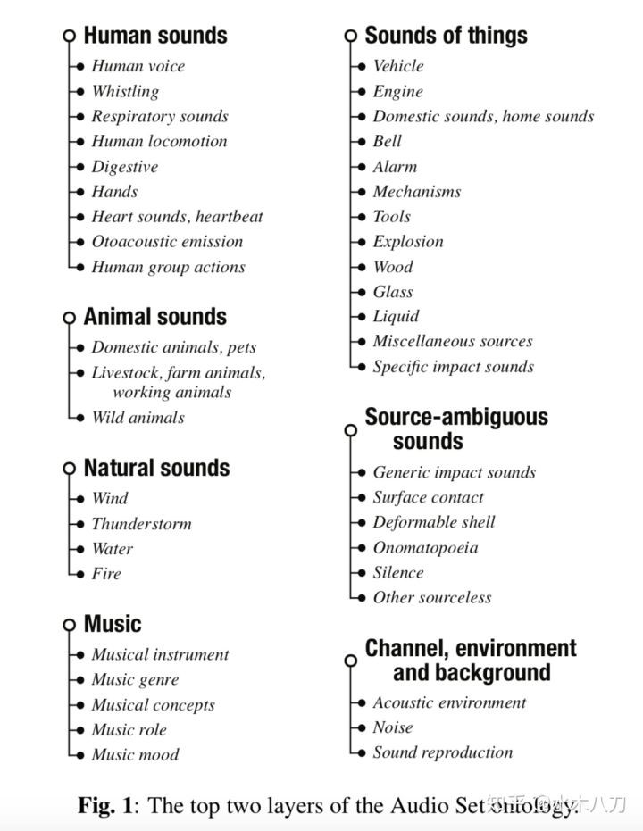
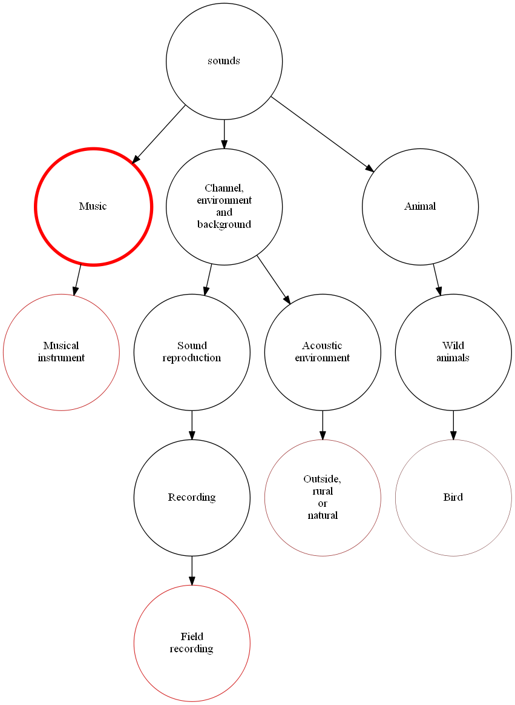

# ML Audio Classifier

A project to classify audio files and visualize the result with machine learning based on IBM [max-audio-classifier](https://developer.ibm.com/exchanges/models/all/max-audio-classifier/)

## max-audio-classifier
recognizes a **10-second**, signed 16-bit PCM **wav** file as an input, generates embeddings, applies PCA transformation/quantization, uses the embeddings as an input to a multi-attention classifier and outputs top 5 class predictions and probabilities as output. The model currently supports **527** classes which are part of the google **AudioSet** Ontology.

The model was trained on AudioSet as described in the paper 'Multi-level Attention Model for Weakly Supervised Audio Classification' by Yu et al.

## Google AudioSet
[AudioSet](https://research.google.com/audioset/) consists of an expanding ontology of 632 audio event classes and a collection of 2,084,320 human-labeled 10-second sound clips drawn from YouTube videos. The ontology is specified as a hierarchical graph of event categories, covering a wide range of human and animal sounds, musical instruments and genres, and common everyday environmental sounds.

## Step
1. change mp3 file to wav
2. cut long audio into 10 seconds pieces
3. classify
4. visualize

## Result
classification result
>bird.wav
>{"status": "ok", "predictions": [{"label_id": "/m/015p6", "label": "Bird", "probability": 0.42554083466529846}, {"label_id": "/m/09ddx", "label": "Duck", "probability": 0.30564624071121216}, {"label_id": "/m/0jbk", "label": "Animal", "probability": 0.1728699654340744}, {"label_id": "/m/025rv6n", "label": "Fowl", "probability": 0.17106477916240692}, {"label_id": "/m/07qdb04", "label": "Quack", "probability": 0.16343526542186737}]}

visualization result

